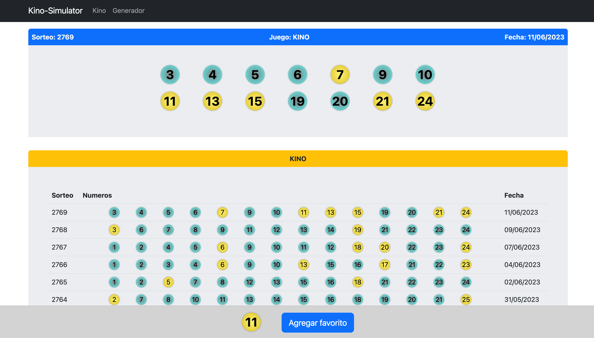

### README: Kino Simulator 

Una aplicación sencilla que simula el juego de lotería Kino! Este proyecto ha sido diseñado para ofrecer una experiencia divertida e interactiva, permitiéndote generar números de Kino aleatorios, guardar tus números favoritos y simular el sorteo de la lotería.

#### [Play demo](https://javiercollao.github.io/lottery-simulator/) 

#### Características



* **Generación de Números:** La aplicación te permite generar un conjunto de números de Kino aleatorios, simulando el proceso de sorteo de la lotería. Puedes elegir la cantidad de balones a generar y guardar tu selección para futuras referencias.

* **Números Favoritos:** Lleva un registro de tus números de la suerte o favoritos añadiéndolos a tu lista de favoritos. La aplicación te permite gestionar tus números favoritos y acceder fácilmente a ellos para generar nuevas combinaciones.

* **Visualización de números consecutivos:** actualmente solo tiene implementado este tipo de visualización para los numeros publicados en los sorteos anteriores.

* **Simulación de la Lotería:** Vive la emoción de un sorteo de Kino. Esta herramienta se realizo con el objetivo de comparar los tickets generados con los del sorteo original utilizando los números favoritos, sin gastar un peso.

### Instalación

Para utilizar este repositorio para el desarrollo, siga estos pasos:
1. Clone el repositorio en su máquina local usando git clone
2. Navegue al directorio del repositorio clonado e instale las dependencias usando npm
```
npm install -E
```
* Para compilar la aplicación en modo desarrollo e iniciarla en localhost:
```
npm run start
```


